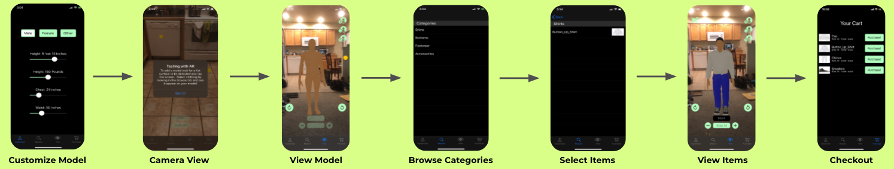

# Wardrobe

Wardrobe is an augmented reality prototype iOS application designed to let users try on clothing using a customized model of themselves. They can then view the model from all angles and see how the clothing looks before purchasing it. This is our functional prototype of the concept, an example of usage is shown below:

# Wardrobe App Instructions:

Note: this repository can only be run on a Mac (because other computers do not have xcode)

1.  Download, update, and install xCode if you don't already have it installed (https://developer.apple.com/xcode/)
2.  clone this repository, navigate to the wardrobe folder in the directory in terminal
3.  install cocoapods (brew install cocoapods)
4.  install the dependencies for this project (pod install)
5.  Open the wardrobe.xcworkspace (if you don't open the workspace it won't compile!) file in the wardrobe folder
6.  (optional) Connect an iOS device using a lightning connector if you are not planning on using the simulator
7.  If iOS device is connected, select the device from the simulator drop-down options next to the "Wardrobe" scheme selection
    (found in the gray rectangle to the right of the "stop" button), otherwise choose a simulator device
    * if you are using a physical device, you will need to sign in and follow this guide: https://medium.com/swiftist/wireless-debugging-xcode-b6e98e26e022
8.  Press the "play" button at the top left corner of the interface
9.  Watch you simulator/device start and load the application
10.  Done!

# Authors
* Alec Goldberg (alechg@umich.edu)
* Alan Chu
* Janna Mandwee
* Steven Wang
* Jackson Mcintyre
* Ryan Scott
